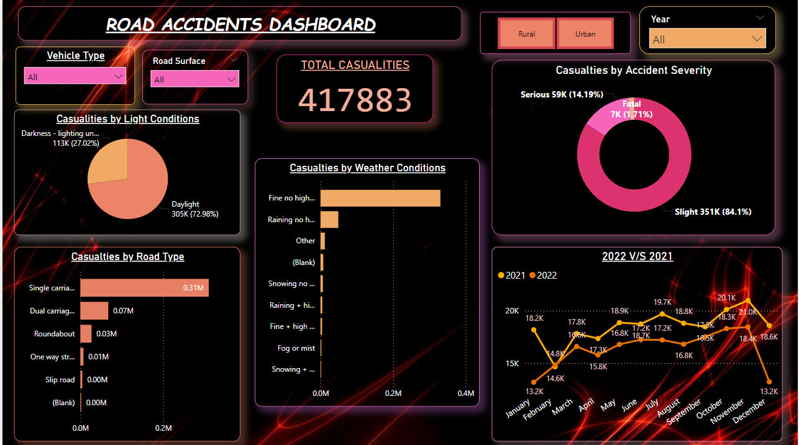

# Road Accidents Dashboard

A **Power BI Dashboard** designed to analyze and visualize road accidents data using interactive charts, graphs, and metrics.



## Overview
This project demonstrates the use of **Power BI** to create an insightful dashboard for analyzing road accident trends. The dashboard provides key insights into:
- Accident counts by location
- Severity of accidents
- Trends over time
- Contributing factors (e.g., weather, road conditions)

## Features
- Interactive and dynamic visuals
- Filters for exploring data by region, time, and severity
- KPIs for quick access to essential metrics
- User-friendly interface for stakeholders to draw actionable insights

## Key Visuals and Metrics
1. **Total Casualties**: Displays the total number of casualties from road accidents.
2. **Casualties by Light Conditions**: Pie chart showing accidents during daylight and darkness.
3. **Casualties by Road Type**: Horizontal bar chart breaking down accidents by road type.
4. **Casualties by Weather Conditions**: Bar chart showing accidents under different weather conditions.
5. **Casualties by Accident Severity**: Donut chart showing slight, serious, and fatal accident counts.
6. **Year-over-Year Comparison**: Line graph comparing 2022 and 2021 accident trends.

## Key Formulas (DAX)
Below are examples of DAX measures used in this dashboard:

1. **Total Accidents**:
   ```DAX
   Total Accidents = COUNT('Accidents'[Accident ID])
   ```

2. **Average Severity**:
   ```DAX
   Average Severity = AVERAGE('Accidents'[Severity])
   ```

3. **Accidents by Region**:
   ```DAX
   Accidents by Region = CALCULATE(COUNT('Accidents'[Accident ID]), 'Accidents'[Region] = "Region Name")
   ```

4. **Year-over-Year Growth**:
   ```DAX
   YoY Growth = 
   DIVIDE(
       [Total Accidents] - CALCULATE([Total Accidents], SAMEPERIODLASTYEAR('Date'[Date])),
       CALCULATE([Total Accidents], SAMEPERIODLASTYEAR('Date'[Date]))
   )
   ```

## Dataset
The dataset used includes:
- Accident details (ID, location, date, time)
- Severity levels
- Weather and road conditions

You can access the dataset here:
[Download Dataset](<https://drive.google.com/drive/folders/1BRH0aufdXTxoWCXIHOTsKr4jRZyvPbJY?usp=sharing>)

## Installation
1. Download and install **Power BI Desktop** if not already installed.
2. Clone this repository or download the `.pbix` file directly.
3. Open the `.pbix` file in Power BI Desktop.

## Usage
1. Load your own dataset or use the provided sample data.
2. Adjust the filters and visuals as per your requirements.
3. Publish the dashboard to Power BI Service for sharing with stakeholders.

## Future Enhancements
- Integration with real-time data sources.
- Adding predictive analytics using machine learning models.
- Enhancing the design for better user experience.

## License
This project is licensed under the MIT License. See the `LICENSE` file for more details.

---
Feel free to contribute to this project or report any issues!
